<h1 align="center">EigenProbe</h1>

<div align="center">
 
| [](https://doi.org/10.5281/zenodo.21731495) | [](https://doi.org/10.48550/arXiv.2607.23950) |
| ----------------------------------------------------------------------------------------- | --------------------------------------------------------------------------------------------------------------------- |

</div>

<p align="center"><i>A practical and precise toolkit for optical scanned probe microscopies: <br>
 s-SNOM, nano-FTIR, nano-IR, and beyond.</i></p>

<p align="center">
    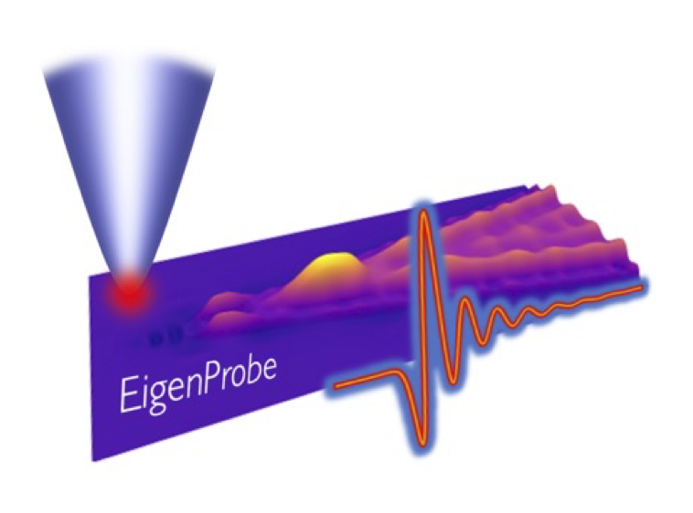
</p>

* [1. Introduction ♟️](#1-introduction-%EF%B8%8F)

* [2. Quick start 🚀](#2-quick-start-)

* [3. Features ✅](#3-features-)
  
  * [3.1 Build an electromagnetic model of an optical scanned probe 💻](#31-build-an-electromagnetic-model-of-an-optical-scanned-probe-)
  * [3.2 Examine the optical response of materials 🔦](#32-examine-the-optical-response-of-materials-)
  * [3.3 Simulate near-field interactions between an optical probe and nearby surfaces ⚡️](#33-simulate-near-field-interactions-between-an-optical-probe-and-nearby-surfaces-%EF%B8%8F)
  * [3.4 Recover optical properties from nano-imaging and -spectroscopy 📈](#34-recover-optical-properties-from-nano-imaging-and--spectroscopy-)

* [4. Getting started 🏁](#4-getting-started-)

* [5. Coming soon 🛠️ 🔜](#5-coming-soon-%EF%B8%8F-)

* [6. Questions?](#6-questions)
  
  ---

## 1. Introduction ♟️

Optical scanned probes enable super-resolution optical imaging and spectroscopy of nano-scale materials - *optical nanoscopy*.  However, quantitative prediction and interpretation of these experiments usually demands a multi-scale physics solution that is easily beyond the reach of simple analytic models.  Nanoscopies can exploit both the *antenna* characteristics of an elongated probe together with the nanometer-scale confinement of light at its sharp apex.   Not only can an optically driven sharp probe excite a surface with intense nano-focused light, but scattering of light by the probe shows fine sensitivity to properties of the surface.  `EigenProbe` is a multi-scale physics solution that describes these aspects and more, allowing to predict and interpret optical nanoscopies of materials within a convenient software package.

The all-python `EigenProbe` package compactly describes mutual electromagnetic interactions between a metallic probe, an optical surface, and incoming/outgoing radiation, in terms of mathematically defined *eigenmodes*.  Much like the modes of an optical cavity, a combination of *eigenmodes* fully describes the electromagnetic field excited in the gap between a *nanoscopy probe* and a nearby optical medium -  a material surface, layered heterostructure, or even a nano-structure!  `EigenProbe` illuminates the connection between nanoscopy measurements of scattered fields, optical forces, absorption by materials, *etc.*, and the underlying properties of materials under study.  Through optimized numerics, `EigenProbe` further provides an interface to solve *inverse problem*s of optical nanoscopy, including direct recovery of optical constants from through nano-imaging or -spectroscopy of nanoscale materials.

> ***Learn more:***  To read about the efficient physical formalism implemented by `EigenProbe`, refer to our detailed pre-print on arXiv:
> 
> - Allen, B.; Lukaskawcez, B.; Bragg, A.; Hirshberg, N.; Fogler, M.; Basov, D. N.; Gilbert-Corder, S.; Bechtel, H.; McLeod, A. S. *Quantitative Infrared Nanoscopy: Probe-Cavity Eigenmodes and Nano-Gap Polaritons for Strongly Coupled Nanoscale Optics*. arXiv July 27, 2026. https://doi.org/10.48550/arXiv.2607.23950.
> 
> Notably, this formalism builds on an earlier work by *Jiang et al.* (2016):
> 
> - Jiang, B. Y.; Zhang, L. M.; Castro Neto, A. H.; Basov, D. N.; Fogler, M. M. Generalized Spectral Method for Near-Field Optical Microscopy. *Journal of Applied Physics* **2016**, *119* (5). https://doi.org/10.1063/1.4941343.

## 2. Quick start 🚀

As a simple example, the following is all you need to simulate an infrared nano-spectroscopy experiment that measures light scattered from a sharp metal probe "tapped" over the surface of a hexagonal boron nitride crystal (as in infrared *scattering-type scanning near-field optical microscopy*, or *s-SNOM*):

```
# --- Build the probe ---
import EigenProbe as EP
P=EP.Probe(name='MyProbe',taper_angle=25)
P.solve_eigenmodes(plot=False);

# --- Simulate the experiment ---
import numpy as np
from EigenProbe.Materials import BN_GPR as hBN,Au
light_energies = np.linspace(500,1700,100) # in wavenumbers
experiment = P.getNormalizedSignal(light_energies,Nkappas=244*2,
                                   rp=hBN.reflection_p,
                                   rp_norm = Au.reflection_p)
#--- Plot the result ---
from matplotlib import pyplot as plt
plt.figure(figsize=(6,4))
for harmonic in [1,2,3]:
    np.abs(experiment['Sn_norm'][harmonic]).plot(label='$S_%i$'%harmonic)
plt.title('Demodulated probe-scattered light, hBN / Au')
plt.legend(loc=(.1,.02),ncol=3)
```

This example exploits the built-in library of `EigenProbe.Materials` to compute the energy-resolved interaction between a boron nitride surface and a realistically modeled, pyramidal, sharp metallic probe.  The code above will immediately predict several (normalized) scattering spectra and generate a publication-quality plot:

<p align="center">
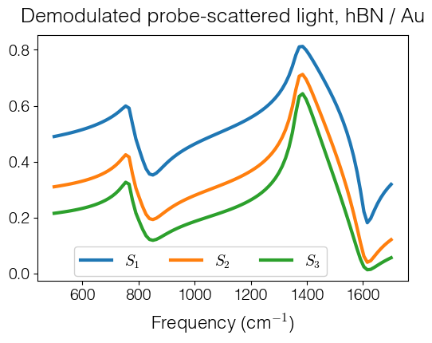
</p>

> ***Try it out!***
> 
> &emsp;Use the included jupyter notebook to get started:
> 
>&emsp;[0 - EigenProbe Quick-Start.ipynb](<./Notebooks/0 - EigenProbe Quick-Start.ipynb>)

## 3. Features ✅

How does a nano-optical probe interact with a material?  A numerical experiment with`EigenProbe` can answer this question through the following steps:

* ***Build a probe***:  A purpose-built method of moments allows to mesh a realistic probe geometry of your choosing.

* ***Compute the probe response function:***  Examine probe-sample eigenmodes - these compactly describe the probe's response to electromagnetic fields.

* ***Build an optical material:***  Define a custom metal, semiconductor, ionic insulator, or layered heterostructure, or select one from a pre-built library.  

* ***Study their interaction:***  Combine the probe and material to predict scattering or nano-focusing of light by the combined, interacting system.

> ***Learn more:*** `EigenProbe` conveniently packages a series of several included [Jupyter notebooks](https://jupyter.org), each showcasing one of the features described below. These notebooks include documentation, and serve as brief tutorials: 
> 
> * [EigenProbe Notebooks](<./Notebooks/>)

### 3.1 Build an electromagnetic model of an optical scanned probe 💻

- The important geometric features of an optical scanned probe can span three decades of lengths scales - from the probe's wavelength-scale size (endowing its *antenna* response to light), down to the nanometer-scale of its sharp apex (endowing its nano-imaging resolution).   `EigenProbe` bridges this multi-scale gap by discretizing an `EigenProbe.Probe` with an adaptive **boundary element method**, capturing every fine detail even for custom geometries.

<p align="center">
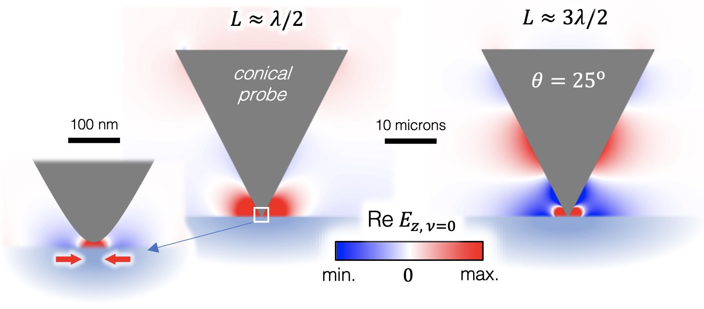
</p>

> **Learn more:**
> 
> &emsp;`EigenProbe.RotationalMoM` implements an efficient method of moments for bodies of revolution according to the standard text:
> 
> * Gibson, W. C. *The Method of Moments in Electromagnetics*; Chapman and Hall/CRC: Boca Raton, FL, 2008. https://doi.org/10.1201/9781420061468.  

- Use the method of moments to compute **eigenmodes** $E_\nu$ that are specific to your probe, including their light-confinement and radiance (or "brightness"), all conveniently quantified with eigenvalues $\rho_\nu$.  `EigenProbe.ProbeSpectroscopies` map how these evolve with probe-sample distance or with the energy of light, providing a complete description of the probe.

| 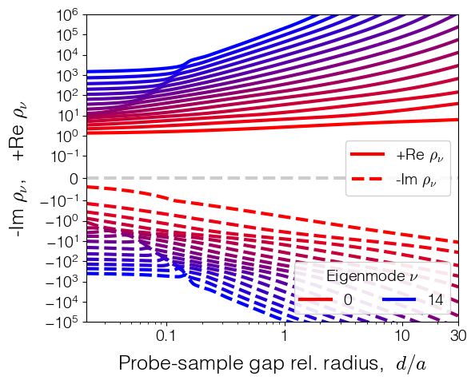 | 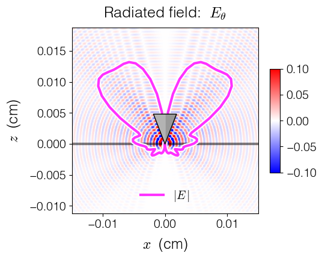 |
| ----------------------------------------------------------------------------------------------------------------- | ----------------------------------------------------------------------------------- |

> ***Try it out!***
>
> &emsp; Use the included jupyter notebooks to make your own probe:
>
> * [1 - Probe building and Probe spectroscopies.ipynb](<./Notebooks/1 - Probe building and Probe spectroscopies.ipynb>)
> * [5 - Probe eigenmode properties.ipynb](<./Notebooks/5 - Probe eigenmode properties.ipynb>)
> * [6 - Unconventional probe geometry.ipynb](<./Notebooks/6 - Unconventional probe geometry.ipynb>)

### 3.2 Examine the optical response of materials 🔦

* Build a custom insulator, semiconductor, or ionic insulator with `EigenProbe.Materials`, or choose any of these from an included library of materials that including monolayer graphene, polymers, and beyond.  To describe thin films or layered media, combine these into a custom heterostructure!
  
  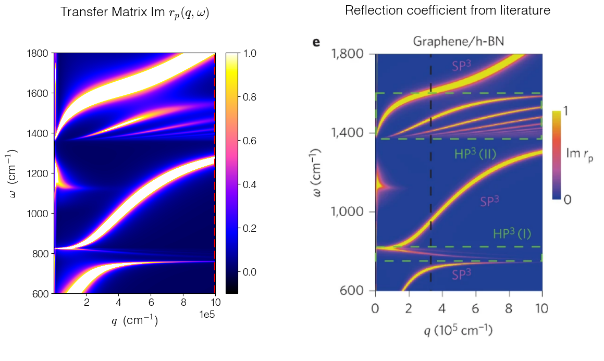

* Surfaces respond to light through a reflectivity $\beta$.  In the most interesting cases, their reflectivity depends also on the energy $\omega$ and momentum $q$ of light.  Use the *Fresnel coefficient* $r_p(q,\omega)$ to predict the dispersion of collective modes of light and matter - *polaritons* - which can be sensed by optical scanned probes.  `EigenProbe` deploys a purpose-built transfer matrix method to predict the reflectivity of complex surfaces.

> ***Try it out!***
>
> &emsp;Use the included jupyter notebook to make your materials, predict their reflection of light, and map the dispersion of polaritons:
>
> * [7 - Using the Materials library.ipynb](<./Notebooks/7 - Using the Materials library.ipynb>)

### 3.3 Simulate near-field interactions between an optical probe and nearby surfaces ⚡️

* Combine your custom probe and custom material(s) together, and let `EigenProbe` predict how they interact.  Optical scanned probes report on *local* material properties through observables (like scattered radiation $E_\mathrm{scat}$) that are quite generally described through a combination of the pre-computed *eigenmodes*:

$$
E_\mathrm{scat}=\sum_{\nu=0}^N \frac{B_\nu}{\beta-\rho_\nu}
$$

* In this simple case, $\beta$ describes the material surface response, $\rho_\nu$ describes the ease of exciting each eigenmode, and $B_\nu$ is the contribution from each eigenmode to the observable.  The *EigenProbe* formalism shows how only a few ($N\approx 10$) eigenmodes suffice for quantitative predictions!  `EigenProbe` automatically handles more complex interactions between probes and surfaces through generalizations of this basic approach.

| 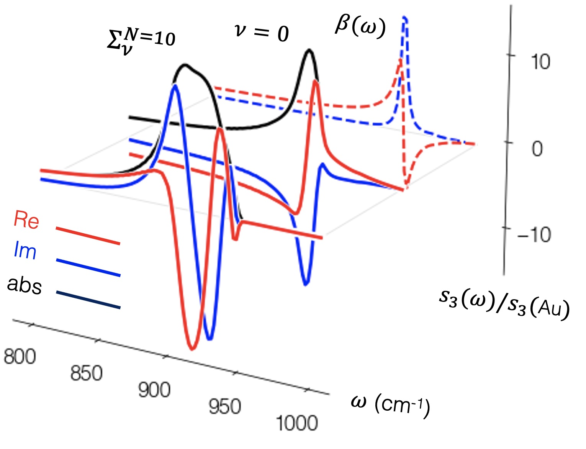 | 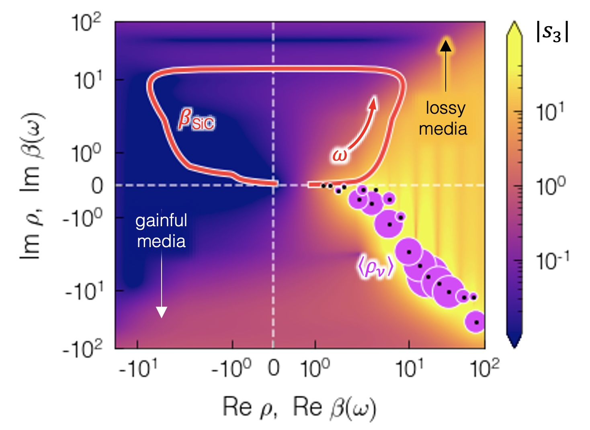 |
| --------------------------------------------------------------------------------------------------------------------- | ---------------------------------------------------------------------------- |

* Examine several different approaches to predict *e.g.* s-SNOM measurements -  many render incredible speedups!  `EigenProbe.ProbeSpectroscopies` allows to predict nano-spectroscopy measurements in a matter of milliseconds.  For different experimental conditions, you can quickly compute rational approximations to analytically relate material properties (like $\beta$) to measurements (like $E_\mathrm{scat}$).

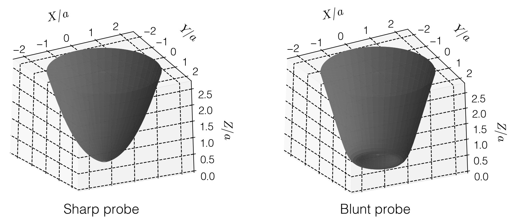

* Unconventional probe geometries can favorably enhance probe-surface interactions. Build several probes and compare how they interact differently with materials of interest.  

> ***Try it out!***  
> 
> &emsp;Use the included jupyter notebooks to simulate probe-surface interactions:
> 
> * [2 - Probe Simulation methods comparison and convergence.ipynb](<./Notebooks/2 - Probe Simulation methods comparison and convergence.ipynb>)
> * [4 - Rational approximation of s-SNOM signal.ipynb](<./Notebooks/4 - Rational approximation of s-SNOM signal.ipynb>)
> * [6 - Unconventional probe geometry.ipynb](<./Notebooks/6 - Unconventional probe geometry.ipynb>)

### 3.4 Recover optical properties from nano-imaging and -spectroscopy 📈

* Since `EigenProbe` predicts with great speed and without loss of accuracy, it is the perfect tool to solve the inverse problem of nano-spectroscopy.  `EigenProbe.EigenInversion` provides tools to dynamically fit measured spectra, from weakly interacting (*e.g.* polymers) and strongly interacting (*e.g.* polariton-resonant) materials alike.  Uniqueness is gauranteed through causally (Kramers-Krönig) constrained fitting to recover energy-dependent optical constants like permittivity $\varepsilon(\omega)$, index of refraction $n(\omega)$, or optical conductivity $\sigma(\omega)$ form uniform materials, or even from thin layers atop substrates.

| 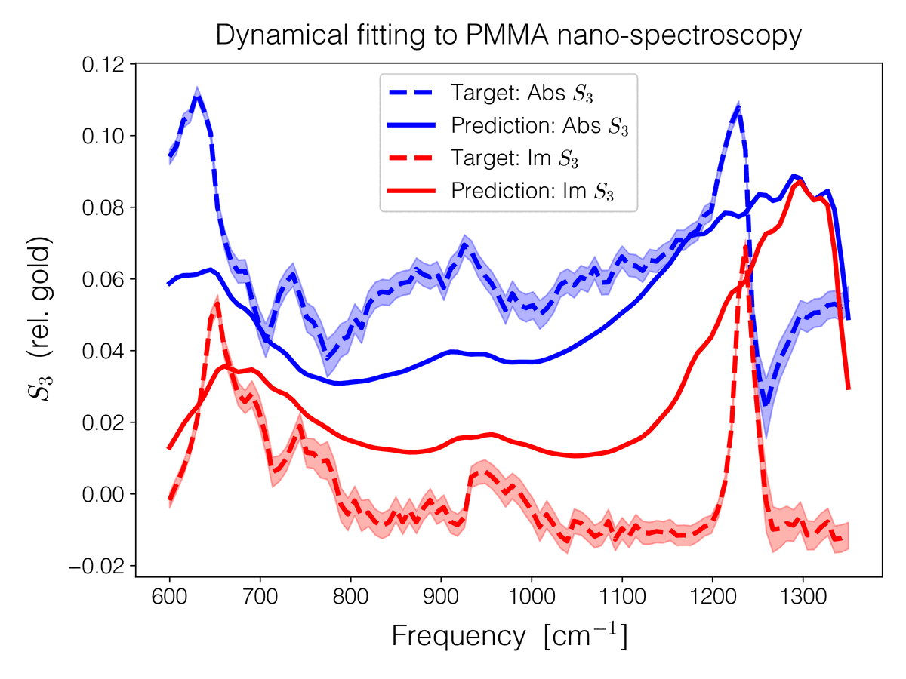 | 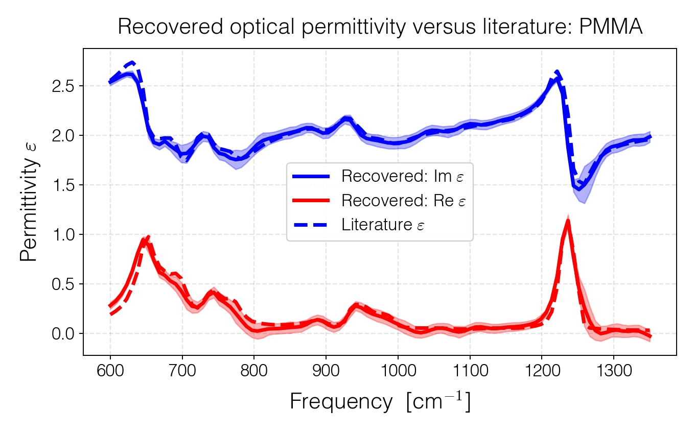  |
| ------------------------------------------------------------------------------- | ------------------------------------------------------------------------------------------------------------------------- |

| 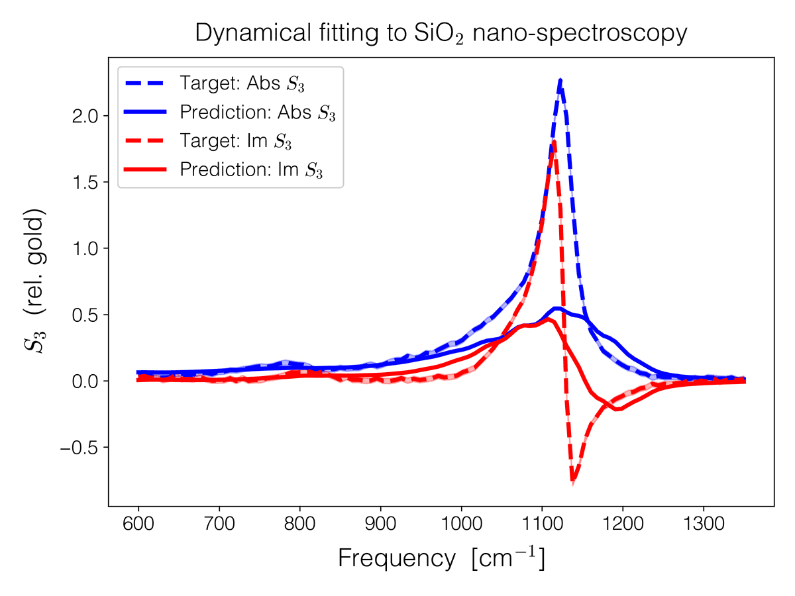 | 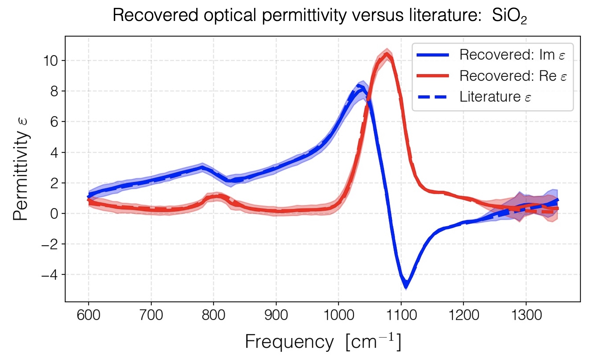 |
| ------------------------------------------------------------------------------- | ------------------------------------------------------------------------------------------------------------------------- |

* Utilize *EigenProbe Inversion* as a **service for real-time recovery of optical constants** from ongoing measurements, including from nano-imaging, even pixel-by-pixel. Run `EigenProbe` in a virtual server:  as shown in [this example](<./Notebooks/3.4 - Application (s-SNOM) - EigenProbe-as-service.ipynb>), you can run `EigenProbe` from your own jupyter notebook and dispatch parallel recovery tasks through a queue.  A typical recovery loop requires only few milliseconds on a laptop, and future speedups remain to be discovered via offboard hardware!

<p align="center">
   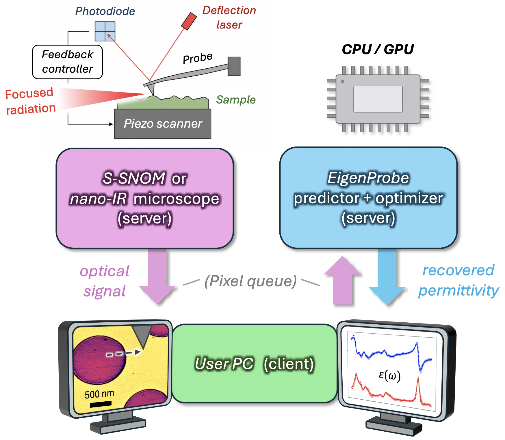
</p>

* Observe a real-time demonstration of few-millisecond-per-pixel permittivity recover from a running experiment.  Dark patches are low-permittivity silicon and bright patches are high permittivity (at least, at energies close to the optical phonon) of silicon oxide:
<!-- EigenProbe-as-service_Si-SiO2grating.mp4 -->
https://github.com/user-attachments/assets/450f8412-f051-43f9-aafa-3d0de09d1734


> ***Try it out!***  
> 
> &emsp;Use the included jupyter notebooks to simulate probe-surface interactions:
> 
> * [3.3 - Application (s-SNOM) - Inversion of nanoFTIR spectra.ipynb](<./Notebooks/3.3 - Application (s-SNOM) - Inversion of nanoFTIR spectra.ipynb>)
> * [3.4 - Application (s-SNOM) - EigenProbe-as-service.ipynb](<./Notebooks/3.4 - Application (s-SNOM) - EigenProbe-as-service.ipynb>)

## 4. Getting started 🏁

* The easiest way to obtain `EigenProbe` (for now) is to clone this repository onto your local machine.  `Eigenprobe` is a self-contained all-python package that can be scripted or utilized interactively in a [Jupyter notebook](https://jupyter.org).

* `EigenProbe` has the following most important python package dependencies; the following versions are sufficient to use `EigenProbe` effectively.

```
numpy:         1.26.4
scipy:         1.10.1
matplotlib:     3.9.4
numba:         0.60.0
sympy:         1.14.0
```

* You can install a [conda](https://docs.conda.io/projects/conda/en/stable/index.html) environment tailor-made for `EigenProbe` that includes all its dependences by running the following shell command from within your cloned `Eigenprobe/config/` directory:

```
conda env create -f EigenProbe.yml # Build a custom environment
conda activate EigenProbe # Activate the environment
```

## 5. Coming soon 🛠️ 🔜

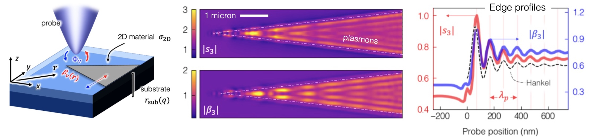

* Predict the outcome of nano-imaging experiments in real-space with the `EigenProbe.EigenProbeImaging` package...

* Build and simulate optical nano-probes with arbitrary geometry beyond the body-of-revolution paradigm...

* Automatic installation of `EigenProbe` distributions through the `conda-forge` repository (*e.g.* `conda install EigenProbe`)...

# 6. Questions?

* Contact the `EigenProbe` creator:
  * Prof. Alexander S. McLeod
  * [mcleoda@umn.edu](mailto:mcleoda@umn.edu)
  * *School of Physics & Astronomy*
  * *University of Minnesota Twin Cities*
    


